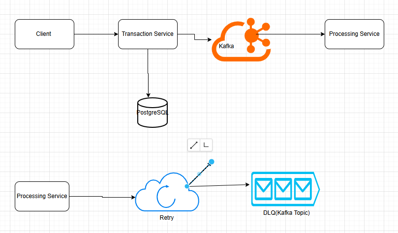

# 🚀 Real-Time Transaction Processing System (Kafka + Java + Microservices)

## 📌 Overview

This project is a **distributed, event-driven transaction processing system** built using **Java, Spring Boot, and Apache Kafka**. It demonstrates how modern backend systems handle **high-throughput, fault-tolerant processing** using microservices architecture.

The system simulates real-world fintech/trading workflows where transactions are processed asynchronously with **retry mechanisms and Dead Letter Queue (DLQ)** for failure handling.

---

## 🏗️ Architecture


### 🔹 Components:

* **Transaction Service**

    * Accepts transaction requests via REST API
    * Stores data in PostgreSQL
    * Publishes events to Kafka

* **Processing Service**

    * Consumes Kafka events
    * Processes transactions
    * Implements retry logic and DLQ for failures

* **Kafka**

    * Event streaming platform for asynchronous communication

* **PostgreSQL**

    * Stores transaction data

---

## 🔄 System Flow

1. Client sends transaction request via API
2. Transaction Service stores data and publishes event to Kafka
3. Processing Service consumes event
4. If processing fails:

    * Retries automatically (with backoff)
    * Sends to **Dead Letter Queue (DLQ)** after max retries

---

## ⚙️ Tech Stack

* **Java 17**
* **Spring Boot**
* **Apache Kafka**
* **PostgreSQL**
* **Docker**
* **GitHub Actions (CI/CD ready)**

---

## 🔥 Key Features

* ✅ Event-driven microservices architecture
* ✅ Kafka producer & consumer implementation
* ✅ Asynchronous processing
* ✅ Retry mechanism with backoff strategy
* ✅ Dead Letter Queue (DLQ) for fault tolerance
* ✅ ErrorHandlingDeserializer for safe message handling
* ✅ Custom KafkaTemplate for DLQ publishing
* ✅ Clean layered architecture

---

## 📦 Project Structure

```
transaction-service/
processing-service/
docker-compose.yml
```

---

## 🐳 Setup Instructions

### 1. Clone the repository

```
git clone https://github.com/<your-username>/real-time-transaction-processing-system.git
cd real-time-transaction-processing-system
```

### 2. Start Kafka & PostgreSQL

```
docker-compose up -d
```

### 3. Run Services

Run both services separately:

* transaction-service → port 8080
* processing-service → port 8081

---

## 📡 API Example

### Create Transaction

**POST** `/transactions`

Request:

```json
{
  "referenceId": "txn-123",
  "amount": 100.5,
  "currency": "USD"
}
```

Response:

```json
{
  "id": 1,
  "referenceId": "txn-123",
  "amount": 100.5,
  "currency": "USD",
  "status": "PENDING"
}
```

---

## ⚠️ Failure Handling Example

If transaction fails (e.g., amount > 500):

* System retries 3 times
* Then moves message to:

```
transactions-topic-dlt
```

---

## 🧠 Key Learnings

* Designing **event-driven distributed systems**
* Implementing **fault-tolerant Kafka consumers**
* Handling **serialization/deserialization issues**
* Managing **retry strategies and DLQ**
* Debugging real-world Kafka issues

---

## 🚀 Future Improvements

* Idempotency (avoid duplicate processing)
* Kubernetes deployment
* Monitoring with Prometheus & Grafana
* API Gateway integration

---

## 👩‍💻 Author

**Preeti Hatti**
[LinkedIn](https://linkedin.com/in/preeti-hatti)
[GitHub](https://github.com/Phatti)

---

